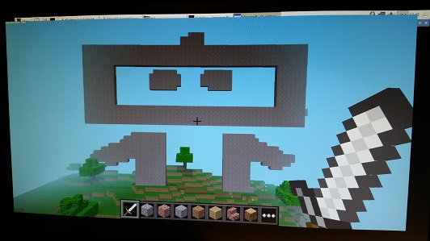

## **Mine Controls.**

### What is it?
Mine Controls are custom hardware controls for Minecraft and the Raspberry Pi!  In this project we show you how to build a custom controller for Minecraft using the Raspberry Pi and the GrovePi.  You can get [all the hardware for this project from the Dexter Industries website.](http://dexterindustries.com/grovepi)

### Setup
See the [full project description for making a custom Minecraft controller for your Raspberry Pi here](http://www.dexterindustries.com/projects/custom-minecraft-controller/).

Software Setup:
  Before we begin, run the following commands to setup:
    `sudo apt-get install minecraft-pi `
    
    `sudo pip3 install python3-xlib`
    
    `sudo pip3 install pyautogui`
    

Hardware Setup:
  Setup the GrovePi on the Raspberry Pi.
  Connect a touch Sensor to port A0.
  Connect a Joystick to port A2.
  Connect a touch sensor to Port D3.
  Connect a touch sensor to Port D4.

To run:
  1.  Start Minecraft on the Pi.
  2.  Start a world.
  3.  Start Python3 (IDLE).
  4.  Open this file (GrovePi-Controller.py)
  5.  Click "Run" --> "Run Module"
  6.  Click back into Minecraft.

See more at the [Dexter Industries](http://dexterindustries.com/).
