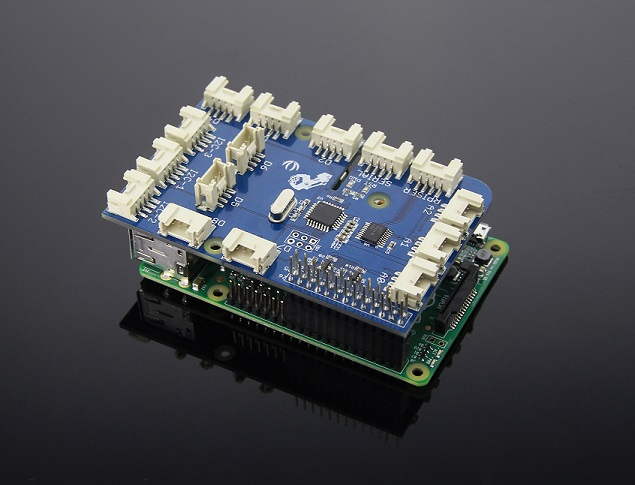

## **Modular Robotics (Dexter Industries) GrovePi** [](https://dexterind.github.io/GrovePi) [](LICENSE)

<!-- Remember to add https://mit-license.org/ of our own -->



The GrovePi is an open-source platform for connecting Grove Sensors to the Rasberry Pi. Create IoT (Internet of Things) devices and inventions without the need of soldering! 

Its official API is written in Python, but it can also be interfaced with in other languages such as C, C#, Go and NodeJS. These other variations of the same library came from our contributors.

## Getting Started

In order to quick install the `GrovePi` repository, open up a terminal and type the following command:

```bash
curl -kL dexterindustries.com/update_grovepi | bash
```

The same command can be used for updating the `GrovePi` to the latest version. For more details on how you can install/update your `GrovePi`, please check this [README](Script/README.md).

To install into a virtual environment, first active your virtualenv and type the following command:

```bash
curl -kL dexterindustries.com/update_grovepi | bash -s -- --user-local --bypass-gui-installation
```

To flash the latest firmware to the GrovePi, run
```bash
cd /home/pi/Dexter/GrovePi/Firmware
bash firmware_update.sh
```

Then, import the `grovepi` module and start playing with it. Its documentation can be found [here](https://dexterind.github.io/GrovePi).

The old guide on getting started with the GrovePi can be found [here](http://www.dexterindustries.com/GrovePi/get-started-with-the-grovepi/). It can still prove to be useful if you're unsure how the GrovePi has to be stacked on top of the Raspberry Pi, although it should be pretty obvious.

## Support

### Raspberry Pi Compatibility
The GrovePi is compatible with the Raspberry Pi models A, A+, B, B+, 2, and B3, B3+, A3+, and 4B.

### Scratch Support
Once you've done the above command, you can install Scratch support if you want it. This step is optional.
```
sudo bash /home/pi/Dexter/GrovePi/Script/install_scratch.sh
```

If your SD card has Scratch 2.0 installed on it, then this will install GrovePi support for it.
GrovePi integration for Scratch 1.4 is also getting installed.

### Want to use a sensor not in the library yet?  
Ask us in the [forums](http://forum.dexterindustries.com/c/grovepi).  Want to use the GrovePi in a language not currently supported? [Ask and we will help](http://forum.dexterindustries.com/c/grovepi).

### Programming the GrovePi
The GrovePi can be programmed in Python, C, C#, Go, and NodeJS on the Raspberry Pi.  Simply start with one of our [example projects](http://www.dexterindustries.com/GrovePi/projects-for-the-raspberry-pi/) or [example code](https://github.com/DexterInd/GrovePi/tree/master/Software).  
The GrovePi uses an Arduino to interface between the Raspberry Pi and the Grove Sensors, and comes programmed with a standard firmware.  The firmware can be rewritten from the Raspberry Pi.  

### Getting Help
Need help? We [have a forum here where you can ask questions or make suggestions](http://www.dexterindustries.com/GrovePi/projects-for-the-raspberry-pi/).

### Getting Ideas
Need an idea to get started?  [We have a few project examples to get your creative juices flowing](http://www.dexterindustries.com/GrovePi/projects-for-the-raspberry-pi/).
