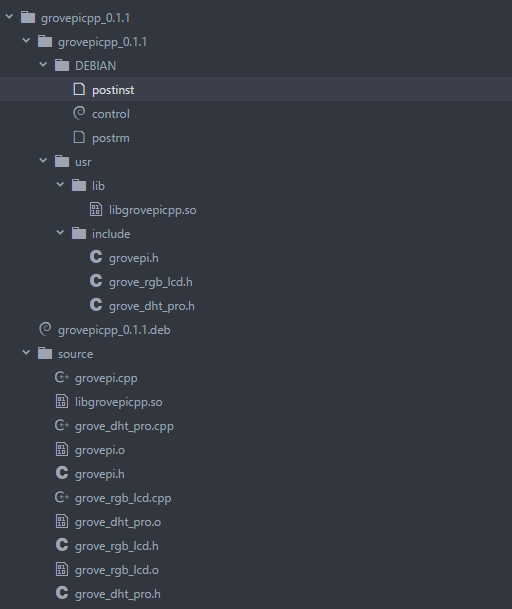

### License

The MIT License (MIT)

GrovePi for the Raspberry Pi: an open source platform for connecting Grove Sensors to the Raspberry Pi.
Copyright (C) 2017  Dexter Industries

Permission is hereby granted, free of charge, to any person obtaining a copy
of this software and associated documentation files (the "Software"), to deal
in the Software without restriction, including without limitation the rights
to use, copy, modify, merge, publish, distribute, sublicense, and/or sell
copies of the Software, and to permit persons to whom the Software is
furnished to do so, subject to the following conditions:

The above copyright notice and this permission notice shall be included in
all copies or substantial portions of the Software.

THE SOFTWARE IS PROVIDED "AS IS", WITHOUT WARRANTY OF ANY KIND, EXPRESS OR
IMPLIED, INCLUDING BUT NOT LIMITED TO THE WARRANTIES OF MERCHANTABILITY,
FITNESS FOR A PARTICULAR PURPOSE AND NONINFRINGEMENT. IN NO EVENT SHALL THE
AUTHORS OR COPYRIGHT HOLDERS BE LIABLE FOR ANY CLAIM, DAMAGES OR OTHER
LIABILITY, WHETHER IN AN ACTION OF CONTRACT, TORT OR OTHERWISE, ARISING FROM,
OUT OF OR IN CONNECTION WITH THE SOFTWARE OR THE USE OR OTHER DEALINGS IN
THE SOFTWARE.

---
# GrovePi C++ library

This library provides the basic functions for using the GrovePi in C++.
See more about the GrovePi here:  https://www.nuget.org/packages/GrovePi/

### To install package:
First of all, you have to `cd` to `../GrovePi/Software/Cpp`
```
$ tar -xzvf grovepicpp_0.1.1.tar.gz
$ cd grovepicpp_0.1.1
$ sudo dpkg --install ./grovepicpp_0.1.1.deb
```

The package contains the following sources:
* grovepi.cpp
* grove_dht_pro.cpp
* grove_rgb_lcd.cpp

### To uninstall package:
```
$ sudo dpkg --remove grovepicpp
```

### To compile with package installed:
```
g++ -Wall [dependencies[,..]].cpp -lgrovepicpp -o [program_name].out// the general format
```
```
g++ -Wall grove_relay.cpp -lgrovepicpp -o grove_relay.out // a trivial example
```

### To compile without package:
```
g++ -Wall grovepi.cpp [dependencies[,..]].cpp -o [program_name].out // the general format
```
```
g++ -Wall grovepi.cpp grove_relay.cpp -o grove_relay.out // a trivial example
```

### Then run the executable:
```
$ ./[program_name].out
```
---
# The basic library functionalities of GrovePi are:
* `initGrovePi()` : function for initializing communication w/ the GrovePi. It uses the implicit address of `0x04`
* `initDevice(uint8_t address)` : function for initializing communication with a device at a specific `address`
* `delay(milliseconds`) : function for delaying given milliseconds
* `pinMode(uint8_t pin, uint8_t mode)`: function for setting a digital/analog port accordingly. `mode` = `INPUT` / `OUTPUT`
* `digitalWrite(uint8_t pin, bool value)` : function for writing `HIGH`/`LOW` values to a digital port
* `digitalRead(uint8_t pin)` : function for returning the digital value (either `HIGH`/`LOW`) read on the given pin
* `analogWrite(uint8_t pin, uint8_t value)` : function for writing an analog value from 0-255 to a given pin
* `analogRead(uint8_t pin)` : function for reading the value on a given pin and which returns a value from 0-255
* `ultrasonicRead(uint8_t pin)` : function for returning the distance in centimeters an ultrasonic sensor reads on a given digital port pin
* `setMaxI2CRetries(int _max_i2c_retries)` : function for setting the maximum number of retries before quitting current operation - **you should not use it**
* `setGrovePiAddress(uint8_t addr)` : change the implicit GrovePi address -> this doesn't change the GrovePi's address (firmware-wise & physically), but it's only setting the address at which GrovePi is reachable - **you should not use it**
* `writeBlock(uint8_t command, uint8_t pin_number, uint8_t opt1 = 0, uint8_t opt2 = 0)` : function for issuing a command to the GrovePi. The command is targeting a certain pin. The optional arguments can be anything depending on the command. (for example for analogWriting, we would use opt1 for sending the value we want to write)
* `writeByte(uint8_t byte_val)` : it only sends a byte to the GrovePi. You can compose the `writeBlock` function by using multiple calls of this function
* `readBlock(uint8_t *data_block)` : returns via the pointer the read data from GrovePi. The length of the array is returned by the function
* `readByte()` : returns a byte from GrovePi

# Attention:
* it's currently not supported to use multiple I2C devices with this library, unless you reinitialize communication with the device you want to talk to (w/ `initgrovePi()` or `initDevice(uint8_t address)`
* for any of the given functions in this library, if an error occurs on the I2C line, a `GrovePi::I2CError()` is thrown. `GrovePi::I2CError()` is derived from `std::runtime_error`
* the library is included in `GrovePi` namespace, so don't forget to use the resolution operator or the `using` command.


# How to create a deb package:

Extract the `tar package` and `cd` into its directory. The folders' hierarchy is this.





----------


You'll see that in the `source` folder there are the source files along with the `.o` object files and `.so` files (which are the shared libraries).

In order to generate the **shared libraries** we need to follow the next steps
### **Step 1**
 Compile all the `.cpp`  files into position independent code (object files) which are required for creating a shared library:

    g++ -C -Wall -Werror -fpic [cppfile]
Run the following command to create a shared library:

    g++ -shared -o libshared.so [list of .o files]
The name of the library **must** have at all times the prefix `lib` and the suffix `.so`. The rest of it is the name of the library. This means that this `libgrovepicpp.so`  file name suggests that our library is called `grovepicpp`.

After we're done with it, we have to copy the shared library to the `grovepicpp_x.y.z/usr/lib` folder.


----------


### **Step 2**
Copy all the header files from the `source` folder to `grovepicpp_x.y.z/usr/include` (make sure you clean the `include` folder).


----------


### **Step 3**
Open `control` file from `grovepicpp_x.y.z/DEBIAN/` folder and modify the version accordingly.
Let's say we have a version like this: `0.2.1`:

 1. the first digit represents a major release: like a complete redesign or architecture. It's generally accepted that `0` as a "major release" actually means that the release it's yet to be completed. We'll have it this way as long as we don't have a versioning scheme in all of our repo(s)
 2. the second digit represents a new feature added to the current architectural scheme
 3. the third digit represents a bug-fix / a really small change / and so on.

Also, please modify all the other folders name according to the version number.


----------


### **Step 4**
Go at the directory level where you can see the 2 main folders: `grovepicpp_x.y.z` & `source`.
We need to create the actual package and and we'll type:

    dpkg-deb --build grovepicpp_x.y.z/


----------


### **Step 5**

`cd` out of that folder and archive the folder (with its all files) with the command:

    tar -csvf grovepicpp_x.y.z.tar.gz grovepicpp_x.y.z/


----------


### Voilà! You now have a package ready to be delivered.
