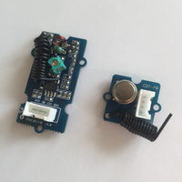

Grove 433MHz Simple RF link kit
===============================

This kit contains two Grove components: a transmitter (TX) and a receiver (RX).
Both are tuned to the 433MHz frequency, which is frequently used in short range communication between devices. 
As a result, these components can be used in various use cases. This library helps with some of these.

GrovePi supported use-cases
===========================

Remote switch operation
-----------------------

Some devices can be remote-controlled using specific codes sent over the 433MHz frequency. This is the case
of some switches or power outlets easily found on the market.
The `grove_433mhz_tx_rcswitch.py` provides support to command such power outlets by embedding the
[RCSwitch library](https://github.com/sui77/rc-switch/wiki).

Remote control commands reception
---------------------------------

These power outlets come with a RF remote control. The `grove_433mhz_rx_rcswitch.py` library allows to listen to
commands sent by such remote controls.