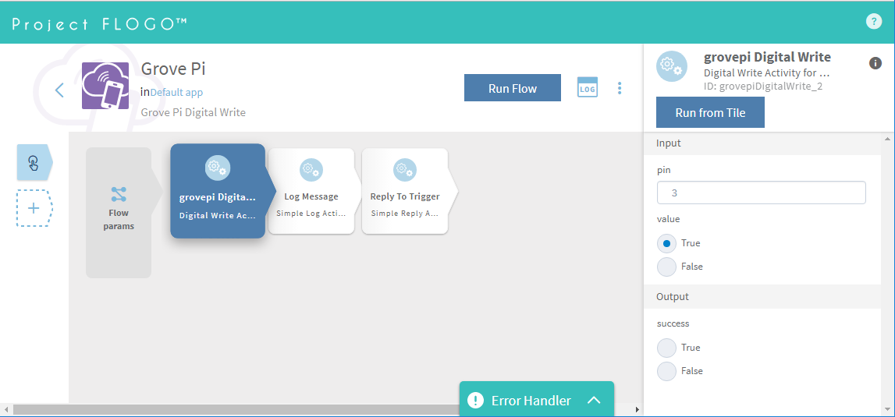

# Flogo.io library for GrovePi
Details about TIBCO Flogo can be found on (http://flogo.io)

## Introduction
This first two Activity can be used easily in any graphically defined Flogo Flow to execute a Digital Write or Read Temperature and Humidity on GrovePi Board.

## Install
All you need to install the new Activity into your Flogo WebUI Environment is the GitHub Path to the Extension: e.g. github.com/DexterInd/GrovePi/Software/flogo/activities/grovepiDigitalWrite

Basically this needs match with the 'ref' in the Activity 'JSON'

select 'add new Activity'

This is visible in the Flow WebUI Server Console, but after a little while you will see the 'success' message within the WebUI. 
And you can start working with the new Activity.

## Activity Interfaces

### Digital Write

Input
- pin           integer pin number
- value         boolean true/false

Output
- success       boolean true/false

### DHT Read

Input
- pin           integer pin number

Output
- temperature   string
- humidity      string

## Remarks
Based on the GOlang GrovePi Implemenation from Falco Tomasetti and [didrocks](https://github.com/didrocks)

You will need to install mrmorphic hwio library: 
go get github.com/mrmorphic/hwio

