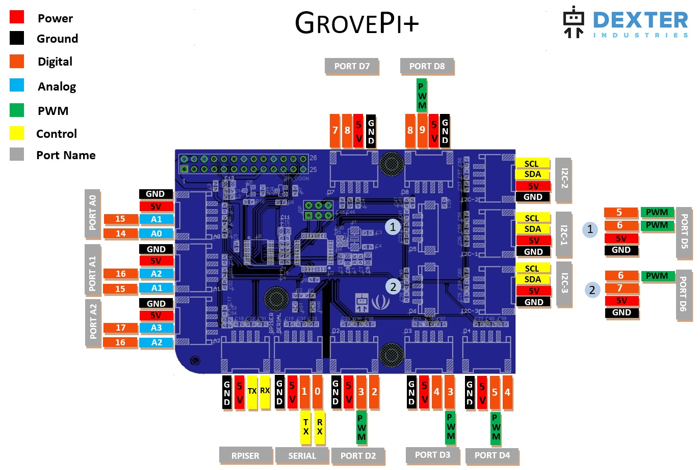

## Port Layout

The GrovePi+ has multiple types of ports:

1. _Analog_ ports - **A0**, **A1**, **A2** - with these ports you can read the voltage output of sensors. In this diagram, these ports are coloured in blue.
When using the ports with our API, only use integers to designate the port of your choice such as `0`, `1` or `2`.

2. _Digital_ ports - **D2**, **D3**, **D4**, **D5**, **D6**, **D7** ,**D8** - with these ports you can read and write digital values of 1 or 0. In the above
diagram, these ports are coloured in orange. When using the ports with our API, only use integers to designate the port of your choice such as `2`, `3` ... `8`.

3. _PWM_ port - **3**, **5**, **6**, **9** - with these ports you can set a specific voltage output between 0V and 5V by using the concept of duty cycle / PWN / PPM.

4. _I2C_ ports - which are coloured in yellow and have the SDA & SCL acronyms written. The master of this connection is the Raspberry Pi.

5. _Serial_ ports - which are found in the bottom-left corner of the above diagram. _SERIAL_ port is the GrovePi's port whereas _RPISER_ is a bypass to the Raspberry Pi's port,
which has a level converter implemented to accept 5V signals.

## Numbering System

Most of the sensors/actuators that we support have the signal line on the outwards of the grove port. For instance,
the [Grove LED](https://www.seeedstudio.com/Grove-Red-LED-p-1142.html) has the signal line on the edge of the grove port which corresponds to port number 4 on port name _D4_,
so for us this was the reason why the port names we have given actually depend on where the signal lines mostly reside.

Looking at a typical grove cable that comes with any GrovePi kit, the signal line is generally the yellow wire and the white
wire is left unused. As you might have guessed, the yellow wire is the outermost wire of the grove cable.
