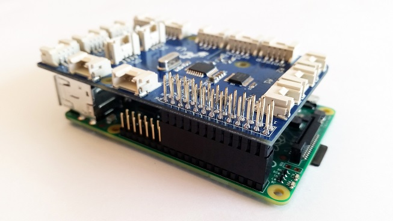

# GrovePi Documentation

The [GrovePi](https://www.dexterindustries.com/grovepi/) is a [Dexter Industries](https://www.dexterindustries.com) open-source platform for connecting Grove Sensors to the Raspberry Pi. With it you can
bring the world of IoT devices to the Raspberry Pi and the only requirement for that is for you to know
how to code in your language of choice.

Whether it's a humidity/temperature sensor, distance sensor or an IR receiver or something as basic as an LED,
the GrovePi can be your answer to these questions.

By default, the language of choice for our library is Python, but support for other languages can be found too
from our contributors such as:

* C/C++
* NodeJS
* Java
* Go
* Ruby
* Scratch
